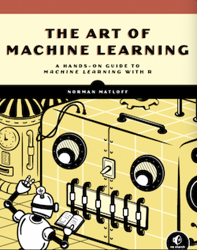

# The Art of Machine Learning, NSP 2023

Hi, everyone.  Norm Matloff of UC Davis here, author of this book.  I do
research, teach and write in computer science and statistics ([see my
Bio](https://heather.cs.ucdavis.edu/matloff.html)).  I've written a
number of books, including an award-winning one, but I've found writing
this one to be especially gratifying.

## Why I wrote this book

There are many great machine learning (ML) books out there, of course,
but none really *empowers* the reader to use ML effectively in
real-world problems.  In many cases, the books are too theoretical, but
I am equally concerned that the applied books tend to be "cookbooks,"
too "recipe-oriented," treating the subject in a Step 1, Step 2, Step
3 manner.  Key concepts, e.g. overfitting, are mentioned just in
passing, no connection made to specific ML algorithms.  Examples are of
the "sanitized" variety.

The result is that while the reader may know the software well, she is
not positioned to *use* ML well in real applications.  So:

* There was a need for a book that *uses* the R language but
is not *about* R.  This is a book on ML that happens to *use R for
examples*, not a book about *the use of R in ML*.

* There was a need for an ML book that recognizes that *ML is
an art, not a science.* (Hence the title of this book.)  No flow
charts, recipes or the like here.

* One does not have to be a math whiz or know advanced math in order
to use ML effectively, but *one does need to understand the
concepts well --- the Why? and How? of ML methods.*

All three of these bullets go back to the "anti-cookbook" theme.
My goal is then this:

> We will *empower* the reader with a strong *practical*,
> real-world knowledge of ML methods --- their strengths and weaknesses,
> what makes them work and fail, what to watch out for.  We will do so
> without much formal math, and will definitely take a hands-on approach,
> using prominent software packages on real datasets. But we will
> do so in a savvy manner.  We will be "informed consumers."

## Recurring special sections

There are special recurring sections and chapters throughout book:

* **Bias vs. Variance** sections explain in concrete terms --- no superstition! --- how these two central notions play out for each specific ML method.

* **Pitfalls** sections warn the reader of potential problems, and show how to avoid them.

* **Diagnostic** sections show how to find areas for improvement of one's ML model.

* **Clearing the Confusion** sections dispel various misunderstandings regarding
  ML that one often sees on the Web, in books and so on, such as dealing with 
  unbalanced data.

* **The Verdict** sections summarize the pros and cons of the methods under discussion.

## Resources

### Code

The R code for all the examples is [here](Code/AllCodeOrdered.R).

### Errata

Correction of errors, and various clarifications, are [here](Errata/Errata.md).

### NSP book site

The NSP Web page for this book is [here](https://nostarch.com/art-machine-learning).  It contains brief and detailed versions of the Table of Contents, as well as a sample chapter.

